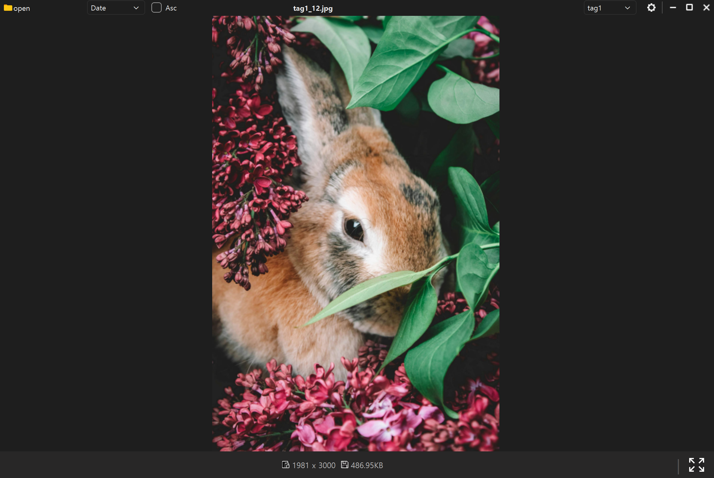
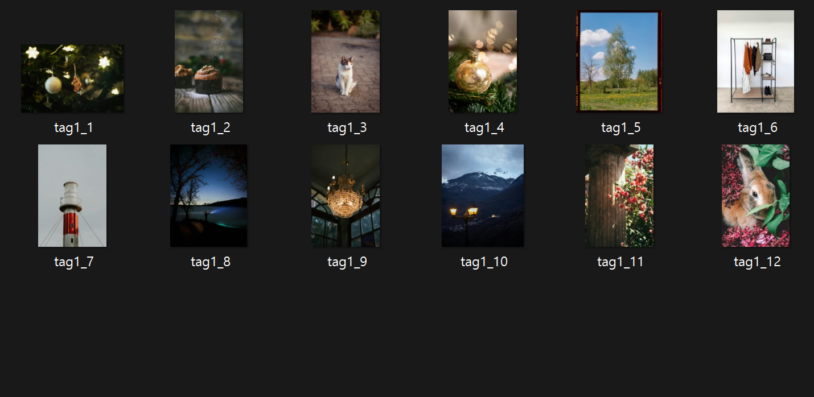

# 📦 Randora Viewer
Randora Viewer는 **간편하고 빠르게 이미지 폴더를 탐색하고**  
Randora Viewer allows you to browse image folders quickly and easily,  

**랜덤 재생, 정렬, 태깅, 리네이밍을 통해 대량 이미지 파일을 효과적으로 관리**할 수 있도록 설계된 데스크톱 이미지 뷰어입니다.  
and is designed to **efficiently manage large volumes of images through random playback, sorting, tagging, and batch renaming**.  

기존 이미지 뷰어는 랜덤 재생 기능이 부족하거나 대규모 이미지 관리가 비효율적이었습니다.  
Traditional image viewers often lack random playback features or effective large-scale image management tools.  

Randora Viewer는 이러한 문제를 해결하기 위해 제작되었습니다.  
Randora Viewer was created to address these limitations.

---

#  주요 기능 / Features

## 📁 1. 폴더 선택 / Folder Selection
- 이미지가 포함된 폴더를 선택하여 로드  
  Load any folder containing images.  
- 최근 사용한 폴더 자동 저장 및 복원  
  Automatically saves and restores recently used folders.  

---

## 🖼️ 2. 이미지 표시 / Image Display
- JPG, PNG, GIF, BMP 등 다양한 이미지 포맷 지원  
  Supports various image formats such as JPG, PNG, GIF, and BMP.  
- 화면 크기에 맞는 자동 리사이징  
  Automatically resizes images to fit the window.  
- 이미지 확대/축소 기능  
  Supports zoom-in and zoom-out.  

---

## 🎲 3. 랜덤 이미지 보기 (Random Mode) / Random Image Viewing (Random Mode)
- 랜덤 모드 선택 시 임의의 이미지 큐 생성  
  Generates a randomized image queue when Random Mode is selected.  
- 중복 없는 랜덤 재생 가능  
  Supports non-repeating random playback.  

---

## 🔍 4. 강력한 정렬 기능 / Advanced Sorting Features
정렬 기능은 대량 이미지 관리의 핵심 요소입니다.  
Sorting is a key feature for efficient bulk image management.  

- 이름 기준 오름차순 · 내림차순  
  Sort by name (ascending / descending).  
- 수정 날짜 기준 오름차순 · 내림차순  
  Sort by modified date (ascending / descending).  
- 특정 키워드를 선택하면 해당 이미지들만 표시  
  Filters and displays only images with the selected keyword.  

---

## 📝 5. 파일 이름 일괄 변경 / Batch File Renaming
- 파일명의 앞부분을 특정 키워드로 일괄 변경  
  Batch-prefix filenames with a selected keyword.  
- 숫자 순서에 따른 자동 리네이밍  
  Automatically renames files in numeric order.  
- 대규모 이미지 관리에 매우 유용  
  Highly effective for organizing large collections of images.  

---

## ⚙️ 6. 기타 기능 / Additional Features
- 이미지 파일명 및 해상도 표시  
  Displays file name and resolution.  
- Del, F11등의 키 바인딩   
  Key bindings such as Del, F11, etc. 
- 세션을 JSON 형태로 저장해 재시작 시 설정 유지  
  Saves session as JSON to retain settings after restart.  

---

# 🔧 기술 스택 / Tech Stack
- Python 3.x  
- PyQt6  
- Pillow  
- PyInstaller  

---

# 📥 다운로드 및 실행 / Download & Run
1. 레포지토리의 **Releases** 탭으로 이동  
   Go to the **Releases** tab.  
2. 최신 버전의 **RandoraViewer.zip** 다운로드  
   Download the latest **RandoraViewer.zip**.  
3. 압축 해제 후 **RandoraViewer.exe** 실행  
   Extract and run **RandoraViewer.exe**.  

---

# 📄 라이선스 / License
- 이 프로젝트는 **MIT License**를 따릅니다.  
  This project is licensed under the **MIT License**.

---
# 🖼️ 스크린샷 / Screenshots
프로그램 실행 화면 예시입니다. 
Here are example screenshots of the application.

  

